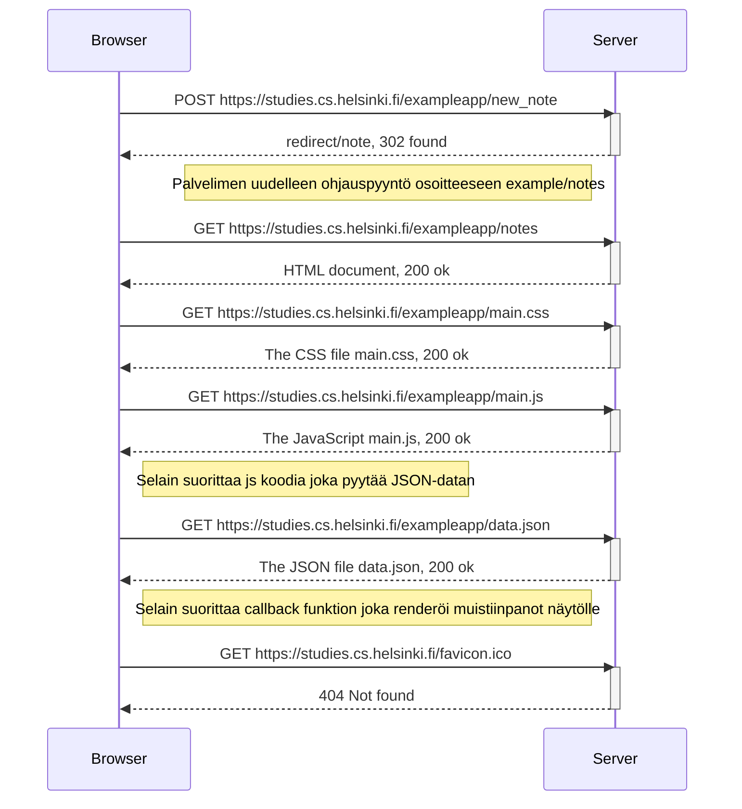

# 0.4 Uusi muistiinpano

``` mermaid
sequenceDiagram
    participant Browser
    participant Server

    Browser->>Server: POST https://studies.cs.helsinki.fi/exampleapp/new_note
    activate Server
    Server-->>Browser: redirect/note, 302 found
    deactivate Server

    Note left of Server: Palvelimen uudelleen ohjauspyyntö osoitteeseen example/notes

    Browser->>Server: GET https://studies.cs.helsinki.fi/exampleapp/notes
    activate Server
    Server-->>Browser: HTML document, 200 ok
    deactivate Server
    
    Browser->>Server: GET https://studies.cs.helsinki.fi/exampleapp/main.css
    activate Server
    Server-->>Browser: The CSS file main.css, 200 ok
    deactivate Server
    
    Browser->>Server: GET https://studies.cs.helsinki.fi/exampleapp/main.js
    activate Server
    Server-->>Browser: The JavaScript main.js, 200 ok
    deactivate Server

    Note right of Browser: Selain suorittaa js koodia joka pyytää JSON-datan

    Browser->>Server: GET https://studies.cs.helsinki.fi/exampleapp/data.json
    activate Server
    Server-->>Browser: The JSON file data.json, 200 ok
    deactivate Server

    Note right of Browser: Selain suorittaa callback funktion joka renderöi muistiinpanot näytölle

    Browser->>Server: GET https://studies.cs.helsinki.fi/favicon.ico
    activate Server
    Server-->>Browser: 404 Not found
    deactivate Server
```
